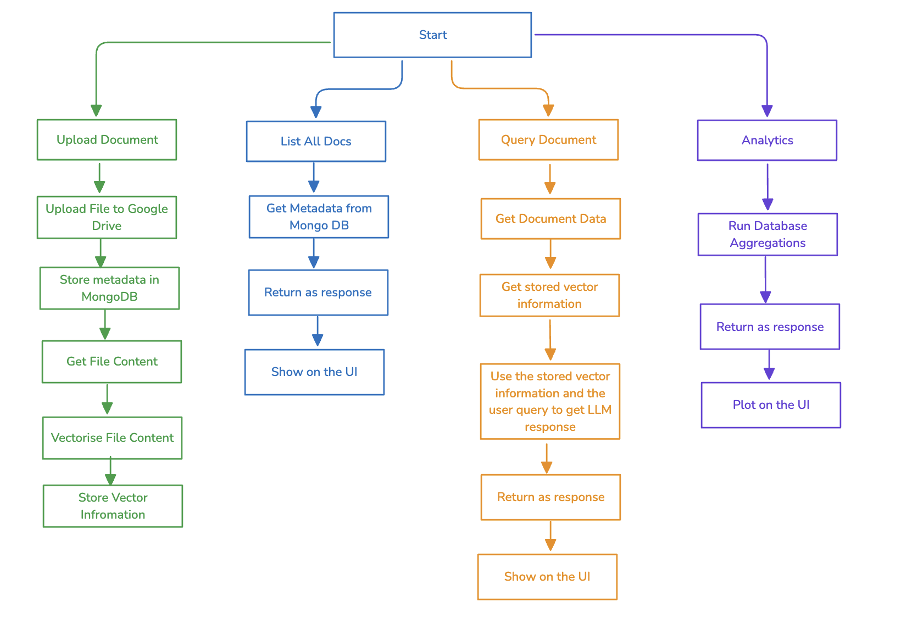
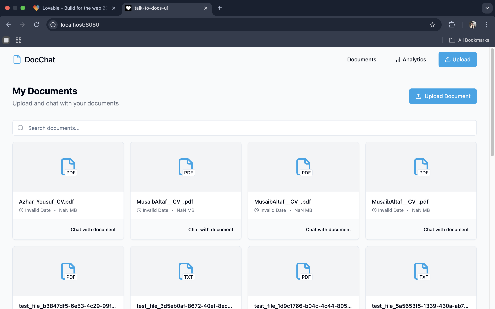
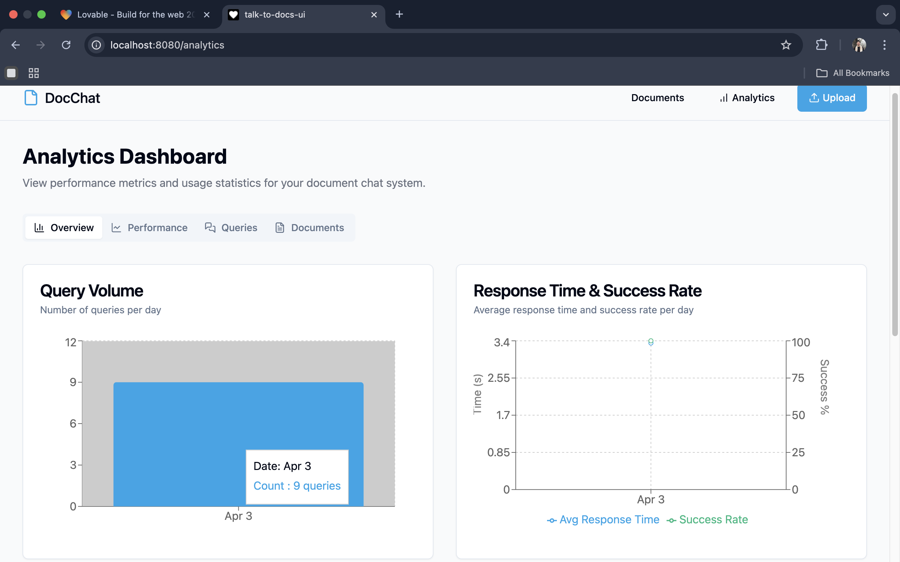
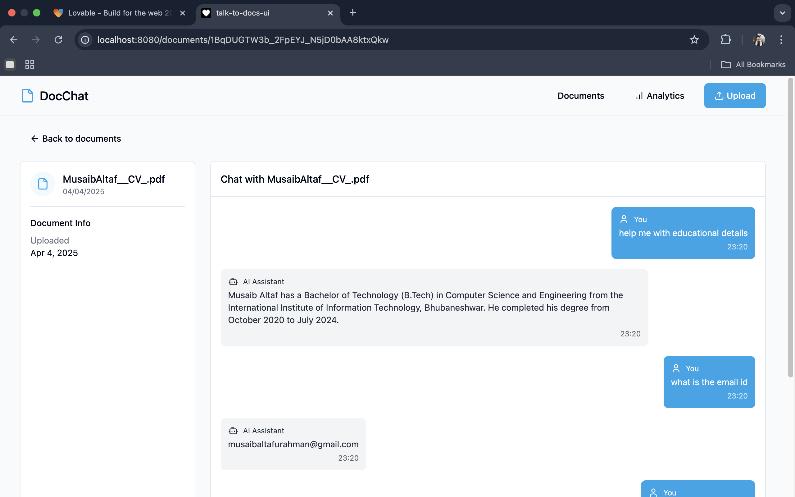

# Agent Powered Knowledge Base + Metrics Dashboard

### Architecture Diagram

### Demo Video
https://www.loom.com/share/e105b3e89296499aab4d02a1481a4202

### Technologies used

1. Flask: For running the backend logic and exposing it over APIs.
2. Langchain for overall LLM management, document vectorization and data retrieval.
3. FAISS: For vector storage and retrieval
4. MongoDB.
5. Google Drive.

### How it works

So, the platform has multiple features, so let me explain how everything works from a technical and a logical POV

1. File Upload: When a user uploads a file over the upload API, the file is first saved on premise. Then the file is uploaded to Google Drive for storage purposes. Drive returns a file ID on succesfull upload, so that along with other metadata is stored in MongoDB. After that, the file is vectorized using OpenAI Embeddings and FAISS, then stored using FAISS index. Finally, the local file is deleted. In case of anything wrong in between, an error is returned and the file, if downloaded on local, is deleted.

2. Document Query: When a user wants to query something about the document, the query is received, along with the document ID. Then the doc metadata is accessed and the stored vector information is loaded. Then using langchain's RetrievalQA chain, that binds an LLM, prompt and vector data together, is used to get the response. The response is stored in MongoDB for storage and returned as the response. Also, the response time is calculated and logged into MongoDB for analytics.

3. Analytics: Since the logs are stored in MongoDB, there are different aggregation pipelines to get analytics like top queried documents etc.

### AI Tools used for:

1. Writing analytics APIs
2. Building the UI using Lovable

## Screenshots

